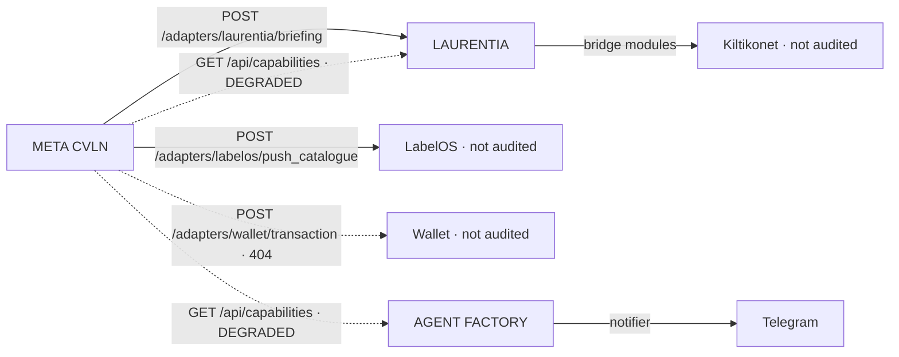

# Cross-Repository Integration

## Realised integration

Exactly one class of realised edge exists: outbound HTTP from META CVLN.

Solid edges are confirmed by code. Dotted edges are implemented on the caller side
and unanswered on the provider side.

## Unrealised integration

| Expected edge | Reality |
|---|---|
| Laurentia consumes the Brain as a service | Consumes a local module instead |
| Laurentia consumes the Agent Runtime | No reference of any kind |
| Agent Factory consumes META governance | No reference of any kind |
| Any system consumes `contracts.py` | No consumer found |
| Shared identity across systems | Three separate auth systems |
| Shared event envelope | Three separate event models |

## Integration readiness assessment

The estate is better positioned than the absence of edges suggests. Three assets make
integration tractable rather than speculative:

1. **META already defines the contracts** — `Event`, `Capability`,
   `RoutingDecision`, `SystemState`, `ExecutionPlan`. The wire vocabulary exists;
   only adoption is missing.
2. **META already implements the prober.** Providers need only answer.
3. **Agent Factory already proves the provider-boundary pattern**, fallback
   included. The target does not require inventing it, only relocating it.

The blocking constraint is therefore ownership, not engineering. See
[`FOUNDER-DECISIONS.md`](FOUNDER-DECISIONS.md).

## Future RFC references

`RFC-0003`, `RFC-0006`.
