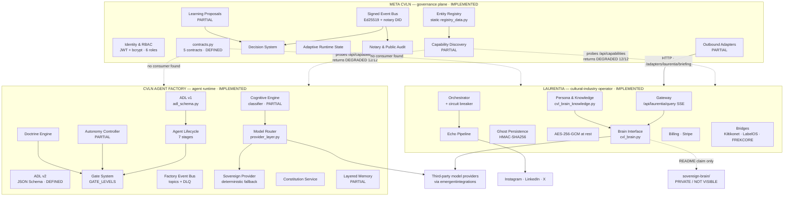
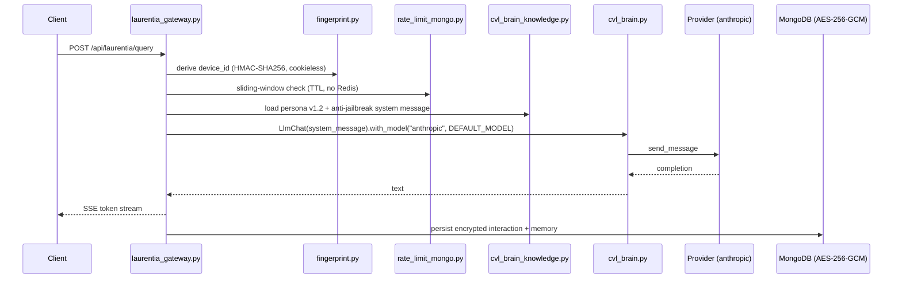
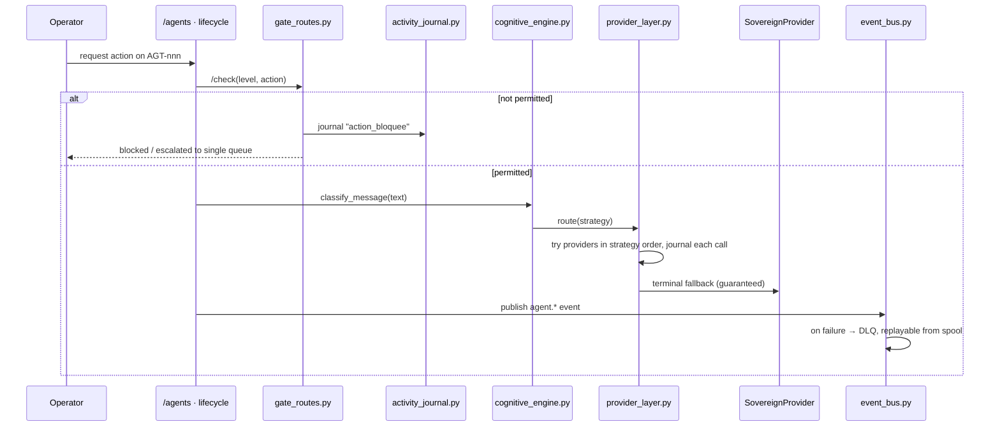
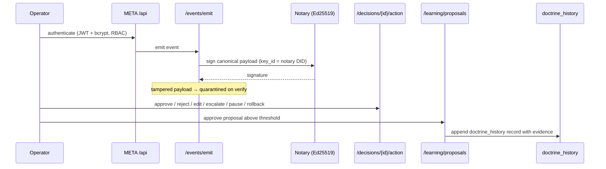

# Current State Architecture

This document describes only what repository evidence establishes. Connections that
evidence does not confirm are labelled `UNVERIFIED`. No component is asserted at the
`DEPLOYED RUNTIME` level, because no audited service was executed.

---

## 1. The finding that governs the rest

CVLN today is **three independently deployable systems that share a vocabulary**, not
one operating system with four layers. Each audited repository:

- has its own `requirements.txt` and FastAPI application;
- opens its own MongoDB connection;
- implements its own authentication;
- implements its own event bus;
- and imports nothing from the other two.

The estate is therefore best described as a federation with one partially wired
governance observer.

---

## 2. Component boundaries

Dotted edges are `UNVERIFIED` or documented-but-unrealised. Note the absence of any
edge from Laurentia to Agent Factory, and any edge from Agent Factory to META.

---

## 3. Data flows

### 3.1 Laurentia query flow — `IMPLEMENTED`

There is no fallback provider in this path. On provider failure the estate has no
recovery route for Laurentia; `routes/social_admin.py` returns `503`.

### 3.2 Agent Factory execution flow — `IMPLEMENTED` with a `PARTIAL` cognition step

Cognition here is `classify_message` plus `internal_response` — deterministic
classification, not model reasoning. Model reasoning is reachable only through
`provider_layer.py`.

### 3.3 META governance and trust flow — `IMPLEMENTED`

Doctrine is never mutated automatically. Every doctrine change is a human act with an
evidence record — the strongest governance property found in the estate.

---

## 4. Authentication and authorisation

| System | Mechanism | Roles | Evidence |
|---|---|---|---|
| META | JWT + bcrypt, RBAC | admin, cfo, hr_lead, ops_lead, legal_lead, employee | `/auth/login`, `/auth/me` |
| FACTORY | `auth_utils.get_current_actor` dependency | actor-based, gate levels | `backend/auth_utils.py`, `gate_routes.py` |
| LAUR | API keys, tiers, Emergent OAuth session endpoint | tier-based (Free/Creator/Infinite/Enterprise) | `services/api_keys.py`, `routes/auth.py` |

There is no single sign-on and no shared identity. An actor in Agent Factory has no
identity in META, and vice versa. `UNVERIFIED`: whether any human account is
intentionally mirrored across systems.

---

## 5. Persistence

Each system owns a separate MongoDB database. Observed collection families:

- **META** — repositories, entities, agents, capabilities, decisions, events,
  evidence, notarizations, `doctrine_history`, `system_keys`.
- **FACTORY** — agents, versions, checkpoints, memory entries, gate journal, events,
  DLQ, doctrine, amendments, closings, backups.
- **LAUR** — `laurentia_instances`, `laurentia_memory`, `laurentia_interactions`,
  `laurentia_activity_log`, sessions, echoes.

Only Laurentia encrypts at rest. Only META stores an asymmetric signing key, and it
stores `system_keys.private_b64` unencrypted — recorded as gap `G-005`.

---

## 6. Memory

Three unrelated stores with no shared schema: Agent Factory's layered memory with
human validation of entries; Laurentia's encrypted `laurentia_memory` per tenant;
META's evidence and event history. No graph structure, no shared identifiers, no
cross-system retrieval. A "CVLN Memory Graph" does not exist today; it is `PROPOSED`.

---

## 7. Model calls

| Path | Boundary | Fallback | Status |
|---|---|---|---|
| FACTORY → `provider_layer.py` | Single enforced boundary (ADR-002) | anthropic → openai → gemini → sovereign | IMPLEMENTED |
| LAUR → `cvl_brain.py` | Single module, one provider | none | IMPLEMENTED, no fallback |
| META → `/brain/ask` | Direct model call | UNVERIFIED | IMPLEMENTED |

Three model call sites, two provider tables, one enforced provider-agnostic layer.

---

## 8. Cross-repository dependencies

Import-level dependencies between audited repositories: **none**.
Runtime edges: META outbound adapters to Laurentia, LabelOS and Wallet, of which the
Wallet edge fails upstream with `404`. Named-but-not-audited counterparties include
Kiltikonet, LabelOS, FREKCORE, KORA, Academy, Wallet and Good Mood — see
`DEPENDENCY-MAP.md`.

---

## 9. What this reconstruction does not establish

- Whether any system is currently deployed, and at what version.
- Whether a sovereign Brain model, weights, adapters or datasets exist.
- Whether the twelve registry entries correspond to live services.
- Whether Laurentia's declared 64 passing tests and META's 17 pass today.

## Future RFC references

`RFC-0003` (runtime consolidation), `RFC-0004` (Laurentia as consumer),
`RFC-0006` (multi-agent orchestration).
