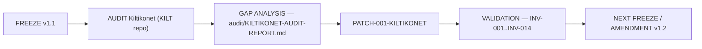

# PATCH-001-KILTIKONET — Post-Freeze Completeness Patch

## Nature

This is a **post-freeze completeness patch** over `OS v1.1 — ARCHITECTURE BASELINE
FROZEN`. It is not part of the original freeze and must never be presented as such.
`constitution/FREEZE-001.md` and `audit/FREEZE-REPORT-v1.1.md` are unchanged.

## Traceability chain

## Authority

Decisions D-015 … D-018 (`decisions/ADR-0015-D-015.md` … `ADR-0018-D-018.md`), under the
amendment procedure of `constitution/FREEZE-001.md` §5 and D-005.

## Scope of change

- **Added** section `kiltikonet/` (system card, identity reconciliation, relations,
  programmes, data flows, contradictions, network, licence/brand, economics, governance,
  security, continuity, legal).
- **Added** `decisions/ADR-0015…ADR-0018`, this record and
  `audit/KILTIKONET-AUDIT-REPORT.md`.
- **Appended rows** to the v1.1 registries: ecosystem (3), vulnerability (V-009…V-012),
  continuity (K-009…K-011), legal (L-008…L-011), decisions (D-015…D-018).
- **Extended** `audit/freeze-manifest.yaml`: vocabulary `HISTORICAL`, `OPEN`; the
  `post_freeze_patches` block; invariants INV-009 … INV-014.
- **Not touched**: the 87 v1.0 documents, the freeze instrument, the v1.1 freeze report,
  `audit/CONTRADICTIONS.md`, INV-001 … INV-008.

## Constraint respected

No company, figure, user, integration, licence, contract, ownership, deployment,
technology, partner or legal status was invented. Facts not attested in the audited
repository are `UNKNOWN`, `OPEN` or SOURCE TO RECONCILE.

## Impact on the next freeze

v1.2 may not be frozen while KC-001 … KC-006 remain OPEN and the legal identity of the
platform is unattested.
