# Target Architecture

> **Status: `PROPOSED`.** Nothing in this document describes an existing capability.
> For what exists, read [`CURRENT-STATE-ARCHITECTURE.md`](CURRENT-STATE-ARCHITECTURE.md).

The target preserves the canonical CVLN vocabulary. It does **not** assume the
canonical dependency direction is implemented — the audit establishes that it is not
(contradiction `C-001`).

---

## 1. Layer model

| Layer | Component | Purpose | Current status |
|---|---|---|---|
| 0 | META CVLN | OS kernel: constitution, governance, registry, permissions, runtime state, workflows, entities, objectives, capabilities | `IMPLEMENTED` as a governance plane; not depended upon |
| 1 | CVL BRAIN | Sovereign intelligence: persona, doctrine, semantic and institutional memory, learning, reasoning, model routing, emergency | `PARTIAL` — interface and persona exist; no single Brain service exists |
| 2 | CVLN AGENT FACTORY | Nervous system: ADL, runtime, scheduler, event bus, autonomy, capability execution, lifecycle, evolution, journal, gates | `IMPLEMENTED` as a standalone runtime |
| 3 | LAURENTIA | Cultural-industry operator: conversations, workflows, reports, artefacts, sessions, jobs | `IMPLEMENTED` as a standalone product |
| 4 | Applications | KORA, CVLN Academy, Wallet, LabelOS, Good Mood, future products | `REFERENCED` |

### Target dependency direction

```mermaid
graph TB
  APP["Layer 4 — Applications<br/>KORA · Academy · Wallet · LabelOS · Good Mood"]
  LAUR["Layer 3 — LAURENTIA<br/>conversations · workflows · reports · artefacts"]
  FACT["Layer 2 — CVLN AGENT FACTORY<br/>ADL · runtime · gates · event bus · journal"]
  BRAIN["Layer 1 — CVL BRAIN<br/>persona · doctrine · memory · reasoning · model router"]
  META["Layer 0 — META CVLN<br/>constitution · governance · registry · permissions"]

  APP -->|"official contracts only"| LAUR
  LAUR -->|"capability execution"| FACT
  LAUR -->|"cognition requests"| BRAIN
  FACT -->|"doctrine + reasoning"| BRAIN
  BRAIN -->|"constitution + permissions"| META
  FACT -->|"registry + gates authority"| META

  classDef proposed fill:#3a2a08,stroke:#d97706,stroke-width:2px,stroke-dasharray:5 4
  class APP,LAUR,FACT,BRAIN,META proposed
```

All edges above are `PROPOSED`. In the current state only one runtime edge exists,
and it runs in the opposite direction (META → Laurentia).

---

## 2. Current versus target, edge by edge

| Edge | Current | Target | Delta |
|---|---|---|---|
| Applications → Laurentia | UNVERIFIED | Contract-only | Publish official contracts |
| Laurentia → Agent Factory | absent | Capability execution | New integration (`G-001`) |
| Laurentia → Brain | local wrapper in-process | Remote Brain service | Extract Brain (`G-004`) |
| Agent Factory → Brain | local `provider_layer` | Brain-owned routing | Move router (`C-006`, `FD-004`) |
| Brain → META | absent | Constitution and permissions | New integration |
| Agent Factory → META | absent | Registry and gate authority | New integration (`G-001`) |
| META → Laurentia | HTTP adapter, implemented | Retained for actuation | Keep, but no longer the only edge |
| Any → `/api/capabilities` | 12/12 DEGRADED | Every system advertises capabilities | Implement provider side (`G-002`) |

---

## 3. Non-negotiable target invariants

1. **One doctrine of record.** The Brain owns doctrine. META ratifies it. Agent
   Factory and Laurentia read it and never write it. Resolves `C-002`.
2. **One provider boundary.** No component may call a model provider directly. The
   pattern already exists and is proven in `FACTORY/backend/provider_layer.py`,
   including a guaranteed terminal fallback; the target promotes that pattern to a
   Brain-owned service rather than reinventing it. Resolves `C-004`, `C-006`.
3. **One signed event schema.** META's `contracts.py::Event` becomes the estate-wide
   event envelope, and Ed25519 signing becomes mandatory rather than META-local.
   Resolves `C-007`.
4. **Capability advertisement is mandatory.** Every CVLN service exposes
   `/api/capabilities` conforming to `contracts.py::Capability`. Resolves `C-005`.
5. **Gates precede execution.** No capability executes without a gate decision, and
   every blocked or escalated action is journalled. Generalises the implemented
   Agent Factory gate system.
6. **Human authority over doctrine change.** Learning may propose; only a human
   approves; every approval carries evidence. Generalises META's implemented
   learning loop. This invariant is the one the estate already honours best.
7. **Sovereignty is a data and control property, not a synonym for a fallback
   provider.** Resolves `C-008`.

---

## 4. Migration sequence

Ordered by dependency, not ambition.

1. **Ratify vocabulary and ownership.** Settle `FD-001` (doctrine and Brain
   boundary) and `FD-004` (model router ownership) before writing integration code.
2. **Implement capability advertisement** in Agent Factory and Laurentia. Lowest
   cost, highest immediate observability gain, and it makes META's existing prober
   meaningful.
3. **Adopt the shared event envelope**, signing included.
4. **Extract the Brain** as an addressable service with a documented API; migrate
   Laurentia's in-process wrapper to a client of it.
5. **Wire Laurentia to the Agent Factory runtime** for capability execution.
6. **Bind gates and registry authority** from Agent Factory to META.
7. **Unify memory** last: it depends on every prior decision.

Steps 2 and 3 are safe under the current architecture and can begin without founder
rulings. Steps 4 to 7 must not begin before step 1.

---

## 5. Explicitly out of scope for v1.0 target

Unified memory graph implementation, cross-repository OpenTelemetry, strict
multi-tenant isolation in META, ISA adoption, and MCL adoption. Each is `PROPOSED`
and separately RFC-gated.

## Future RFC references

`RFC-0002`, `RFC-0003`, `RFC-0004`, `RFC-0005`, `RFC-0006`, `RFC-0007`, `RFC-0008`.
