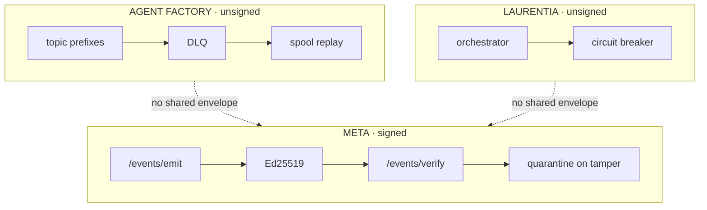

# Event Bus

## Relationships

See [`audit/RESPONSIBILITY-MATRIX.md`](../audit/RESPONSIBILITY-MATRIX.md) for current ownership and [`audit/TARGET-ARCHITECTURE.md`](../audit/TARGET-ARCHITECTURE.md) for target ownership.

## Future RFC references

`RFC-0006`
