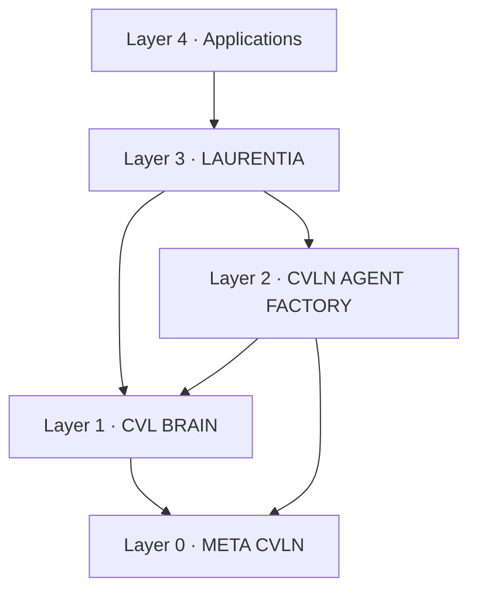

# Layered OS

> **Status: `PROPOSED`.** This artefact was not found in any audited CVLN
> repository. It is a proposal introduced by this specification and must never be
> cited as an existing CVLN capability until its RFC is ratified.

No edge above is implemented today.

## Relationships

See [`audit/RESPONSIBILITY-MATRIX.md`](../audit/RESPONSIBILITY-MATRIX.md) for current ownership and [`audit/TARGET-ARCHITECTURE.md`](../audit/TARGET-ARCHITECTURE.md) for target ownership.

## Future RFC references

`RFC-0006`
