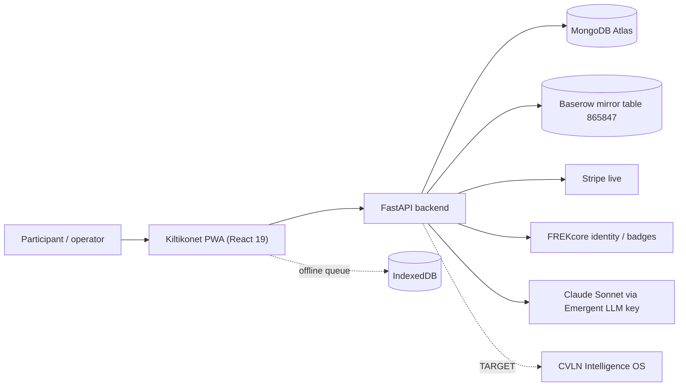

# Kiltikonet — System Card

Audited source: [https://github.com/cultureconnectorg/Kiltikonet-Aout2026](https://github.com/cultureconnectorg/Kiltikonet-Aout2026) — branch `main`, 747 commits, README.md and
KILTIKONET_DOCUMENTATION.md. This card is a governance reference, not a presentation.

## 1. Identity

| Field | Value | Status |
|---|---|---|
| Platform | Kiltikonet / kiltikonet.fr | OBSERVED |
| Stated nature | "Plateforme culturelle souveraine pour Culture Connect 2026, Martinique" | OBSERVED |
| Named organiser | Factory Maker Studio (EURL) / CVLN Group | OBSERVED |
| Licence line | "Propriétaire — Culture Connect / Kiltikonet.fr" | OBSERVED |
| Legal entity operating the platform | not attested | OPEN |
| Association / Network SAS variants | referenced in the patch brief only | UNKNOWN |

Full reconciliation: `kiltikonet/IDENTITY-RECONCILIATION.md`.

## 2. Mission and function

Operate the accreditation, badge, payment and field-scanning chain of Culture Connect
2026 (20–23 May 2026, Fort-de-France, Martinique), with a stated objective of 40 000
FREK-IDs. Function observed: full-stack PWA platform — not a specification repository,
not an OS layer.

## 3. Architecture (observed)

Surfaces observed: `/` vitrine, `/pro` (Espace Pro Omega, 7 modules), `/admin/core`,
`/espace-pro/connexion` (5 authentication methods), `/scan` (field NFC scanner).

## 4. Sub-systems and programmes

`kiltikonet/PROGRAMMES-REGISTRY.md` — five programme rows are evidenced, eight
programme names supplied in the patch brief remain UNKNOWN / source to reconcile.

## 5. Network model

`kiltikonet/NETWORK-MODEL.md`. No operator network, hub structure, territorial
deployment model or international footprint is evidenced in the audited repository. The
only evidenced territory is Martinique, as the event location.

## 6. Actors

Participants (Visiteur, Émergent, Pro, Institu tiers), exhibitors (EXP-B → EXP-D,
EXP-VIP), speakers (INT), field operators (scan), admin/founder roles, partners
(Bronze / Silver / Gold). Source: `KILTIKONET_DOCUMENTATION.md`.

## 7. Data

`kiltikonet/DATA-FLOWS.md` — SOURCE → DATA → DESTINATION → STATUS → EVIDENCE.

## 8. Dependencies and estate relations

`kiltikonet/RELATIONS-REGISTRY.md`. Evidenced technical dependencies: FREKcore, Stripe,
Baserow, Claude Sonnet, MongoDB Atlas. **No evidenced integration** with CVLN Brain,
Agent Factory, KORA, CVLN Academy, LabelOS, Laurentia or MetaCVLN.

## 9. Economics

`kiltikonet/ECONOMIC-MODEL.md` — evidenced tariffs, partner tiers and jeton packs.
Licence, franchise, royalty and SaaS models are **not** evidenced.

## 10. Security · Continuity · Legal

`kiltikonet/SECURITY.md` · `kiltikonet/CONTINUITY.md` · `kiltikonet/LEGAL.md`.

## 11. Decisions

D-015 … D-018 (`decisions/ADR-0015-D-015.md` … `decisions/ADR-0018-D-018.md`).

## 12. Contradictions and unknowns

`kiltikonet/CONTRADICTIONS-KILTIKONET.md` (KC-001 … KC-006, all OPEN). Unknowns:
legal identity, network model, programme catalogue, franchise model, OS integration,
brand ownership, operator certification.

## 13. Status of this card

`PARTIAL`. Evidenced facts are marked; everything else is `UNKNOWN`, `TARGET`, `OPEN` or
`HISTORICAL`. Nothing on this card was inferred from the estate's intentions.
