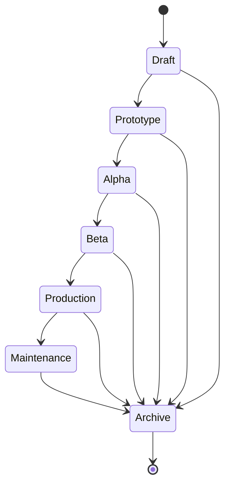

# ADL Agent Lifecycle

Seven ordered stages, enforced by `allowed_transitions()`.

## Rules (implemented)

1. Advance by exactly one stage, or archive.
2. Archive is terminal — no transition leaves it.
3. Skipping stages is rejected by the transition function, not by convention.

## Runtime surfaces

`/agents/{id}/lifecycle` · `/…/state` · `/…/versions` · `/…/diff` ·
`/…/checkpoint` · `/…/checkpoints` · `/…/export` · `/…/wake`. Checkpoint and diff
make lifecycle changes reversible and reviewable.

## Relationships

See [`audit/RESPONSIBILITY-MATRIX.md`](../audit/RESPONSIBILITY-MATRIX.md) for current ownership and [`audit/TARGET-ARCHITECTURE.md`](../audit/TARGET-ARCHITECTURE.md) for target ownership.

## Future RFC references

`RFC-0003`
