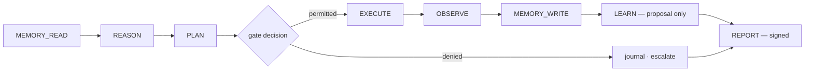

# ISA Execution Cycle (PROPOSED)

> **Status: `PROPOSED`.** This artefact was not found in any audited CVLN
> repository. It is a proposal introduced by this specification and must never be
> cited as an existing CVLN capability until its RFC is ratified.

## Cycle rules

1. A cycle is atomic for reporting: every cycle ends in `REPORT`, including a denied
   one. A denied cycle that is not reported is a governance failure.
2. `LEARN` output is a proposal, never a doctrine mutation.
3. A cycle carries one trace identifier across every instruction.
4. Cycles are resumable from the last successful `MEMORY_WRITE`.

Closest existing artefact: Agent Factory `/cycle` and `/cycles/{cycle_id}`, which
lack instruction-level semantics.

## Relationships

See [`audit/RESPONSIBILITY-MATRIX.md`](../audit/RESPONSIBILITY-MATRIX.md) for current ownership and [`audit/TARGET-ARCHITECTURE.md`](../audit/TARGET-ARCHITECTURE.md) for target ownership.

## Future RFC references

`RFC-0007`
