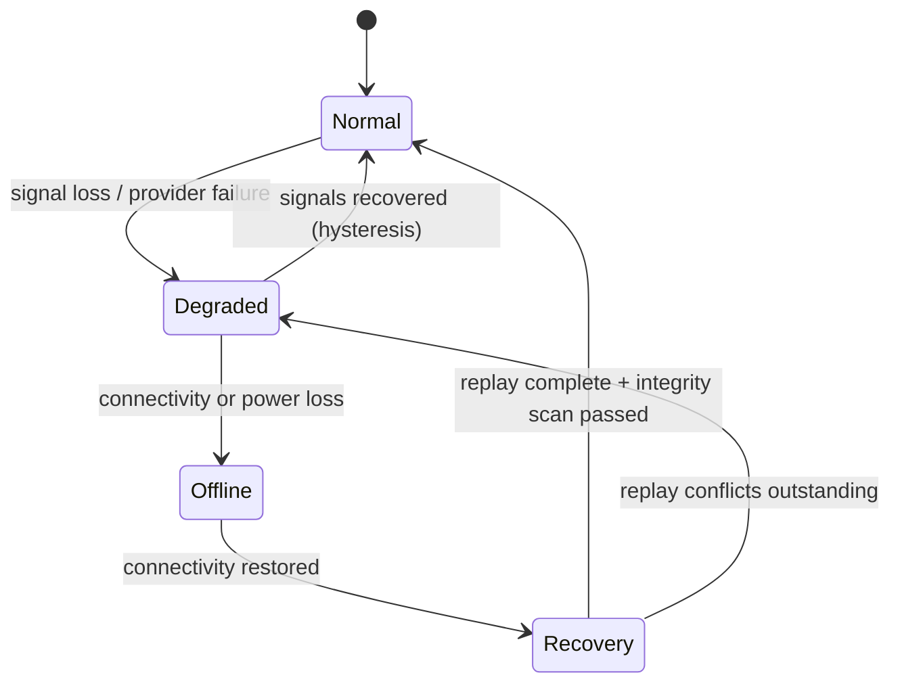

# Continuity Model

## State machine

## State definitions

| State | Definition | Observed control |
|---|---|---|
| Normal | All signals nominal | META `/runtime/state` = normal |
| Degraded | Reduced capability, service preserved | META degraded/critical states with hysteresis |
| Offline | No external connectivity or provider access | FACTORY sovereign deterministic provider |
| Recovery | Reconnected, replaying spooled work | FACTORY event-bus spool replay |

## Rule

Recovery is complete only when replay finished **and** an integrity scan passed. A
partially replayed system remains `Degraded`.

Matrix: `registry/CONTINUITY-MATRIX.md`. Decision: D-006.
